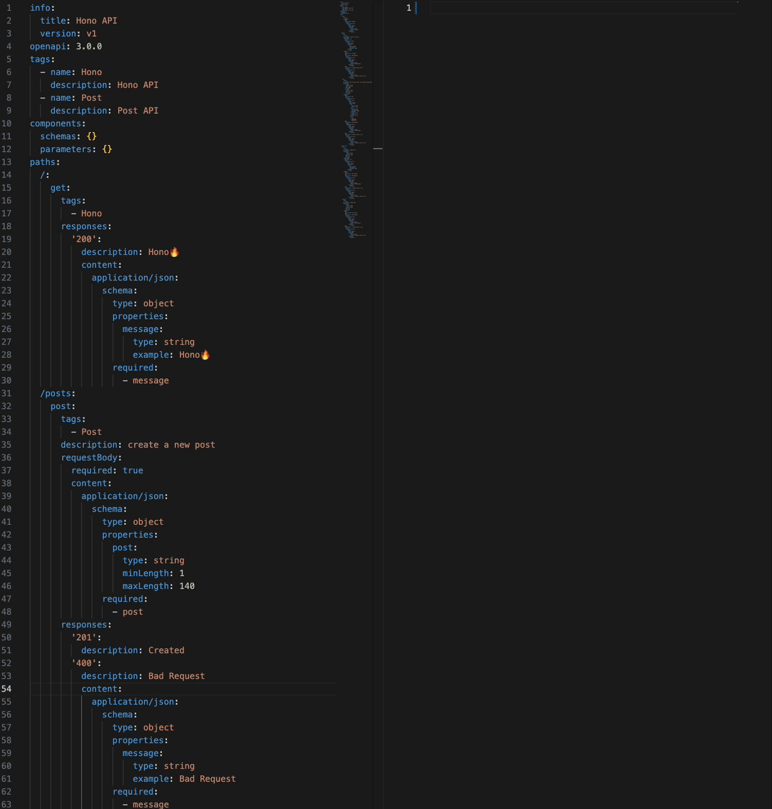

# Hono Openapi Example🔥

&emsp;Generate RPC code from OpenAPI definition

&emsp;The code is currently under development and is confidential.

&emsp;Please wait until we are at a level where we can publish.



## Dependency
```sh
make deps
```

## Migrate
```sh
pnpm migrate
```

## Run

```sh
make run
```

## Accesse Browser
```
http://127.0.0.1:3000/
```